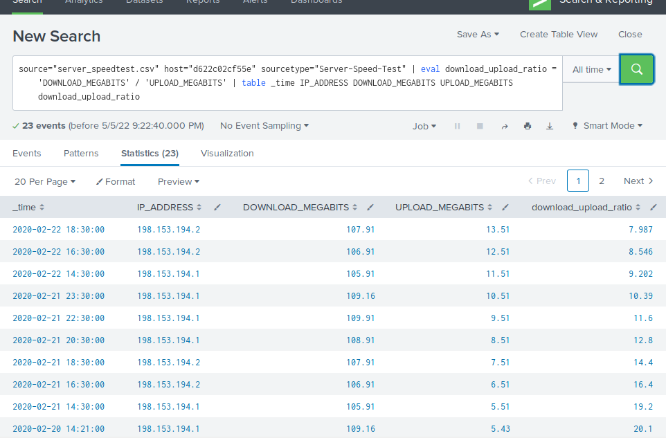
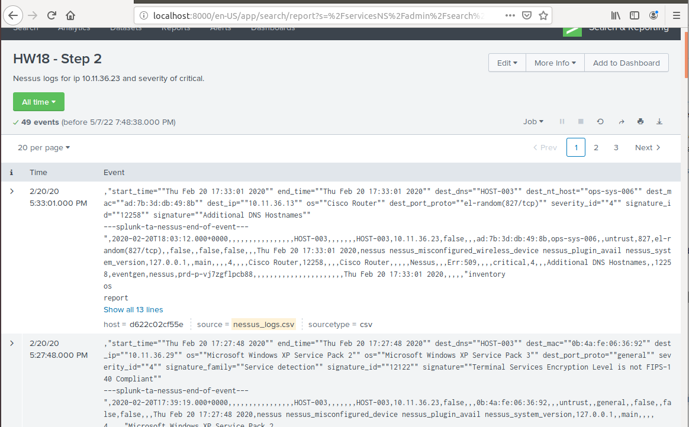
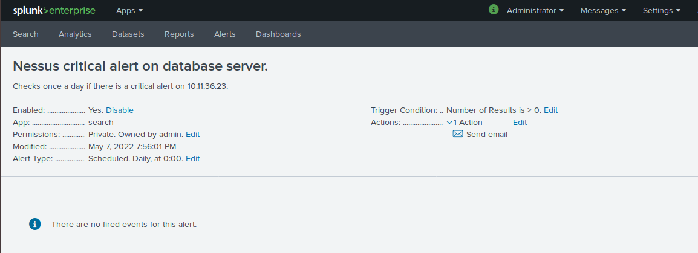

## Cybersecurity Bootcamp Chapter 18 Homework

### Part 1: The Need for Speed

Below is a picture of the search conducted for evaluation of the download and upload speedtest.

#### Questions

 - The approximate time of the attack would be when we had the lowest download and upload speeds. That would be on the 23rd of February, 2020, at 14:30, or 2:30 p.m.
 - Download and upload speeds remained very low until about 20:30 (8:30 p.m.), at which it went to about half of our baseline speeds. We made a full recovery by 23:30 (11:30 pm). 

### Part 2: Are We Vulnerable?

Below are pictures of the report and the alert created for these Nessus scans.

### Part 3: Drawing the (base)line
